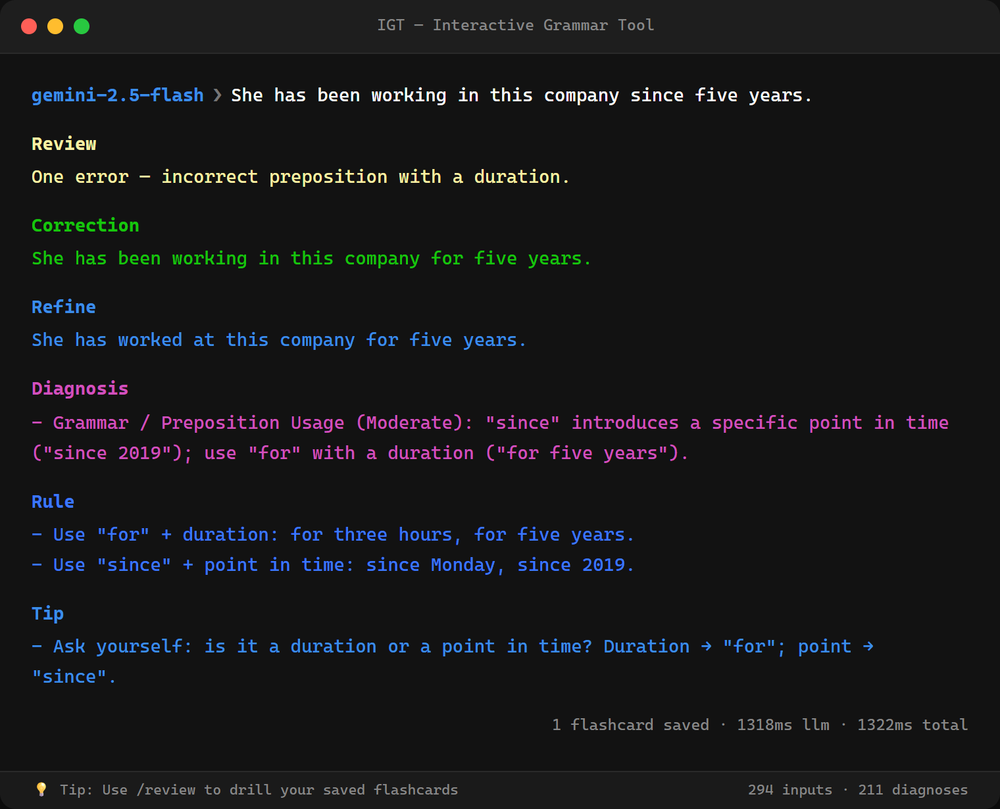
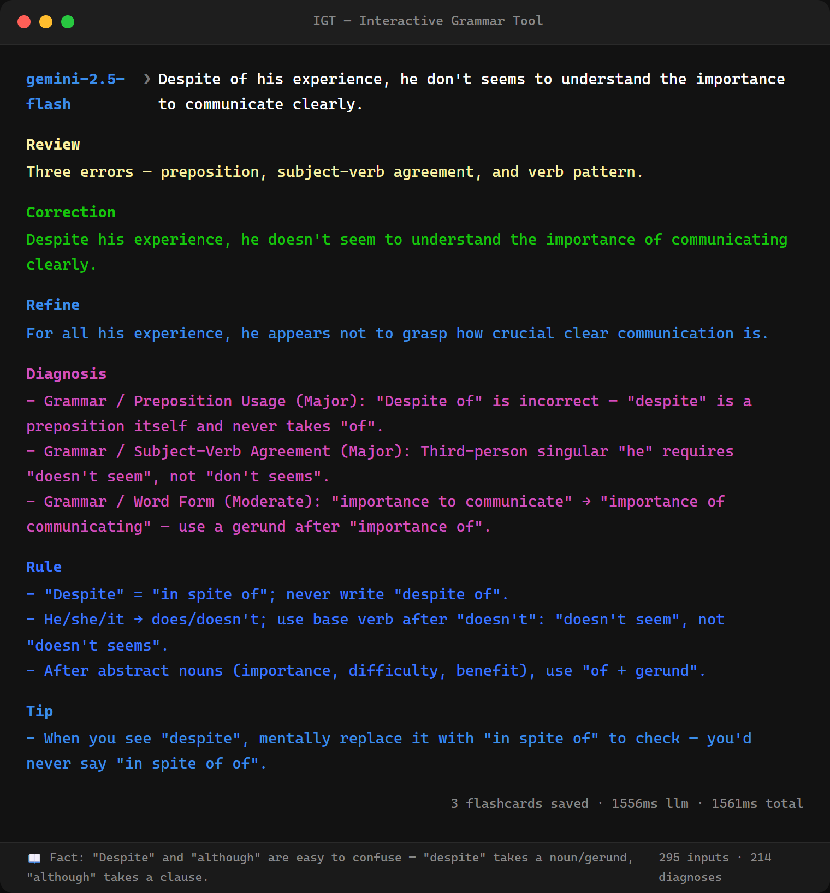
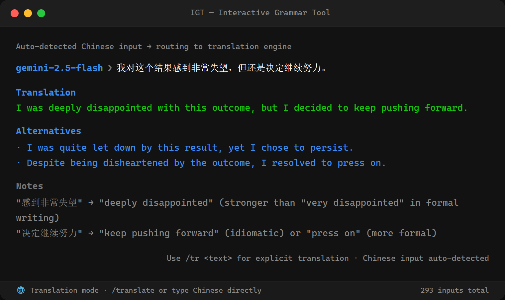
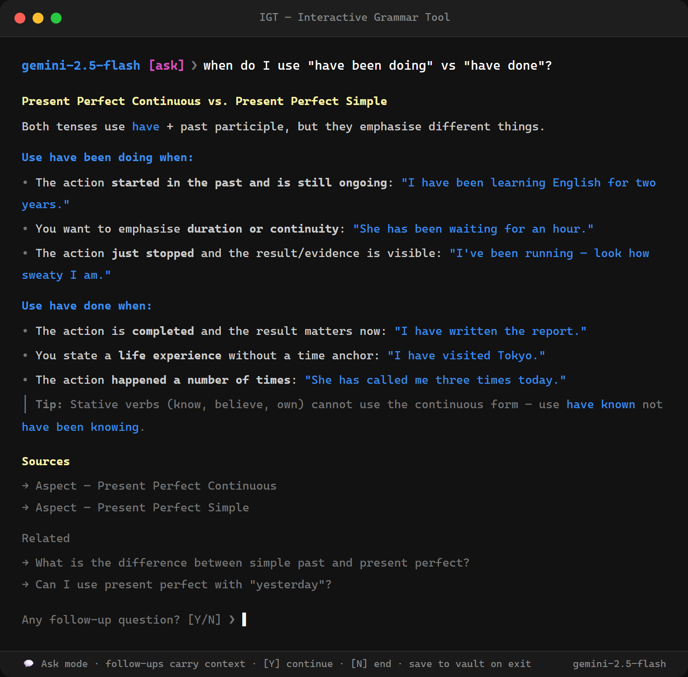
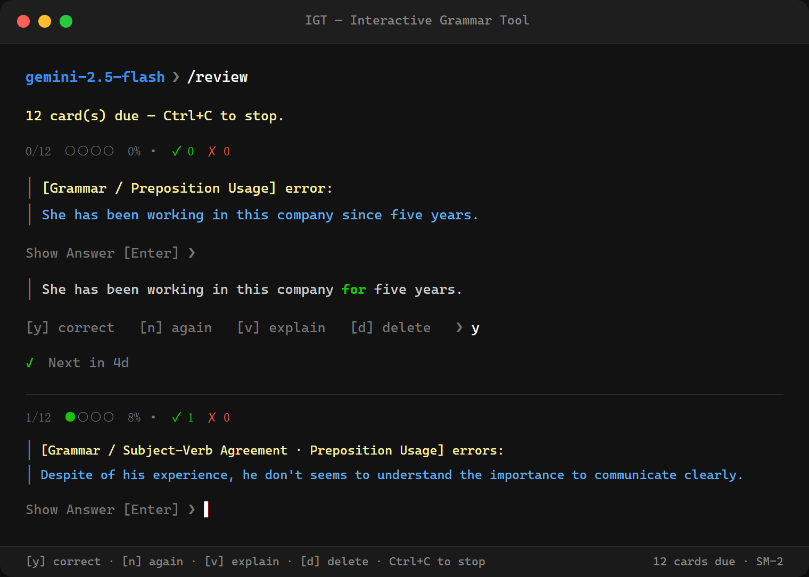
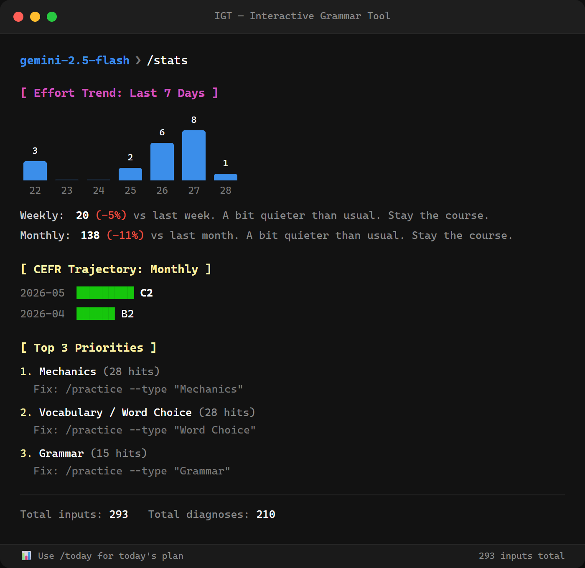
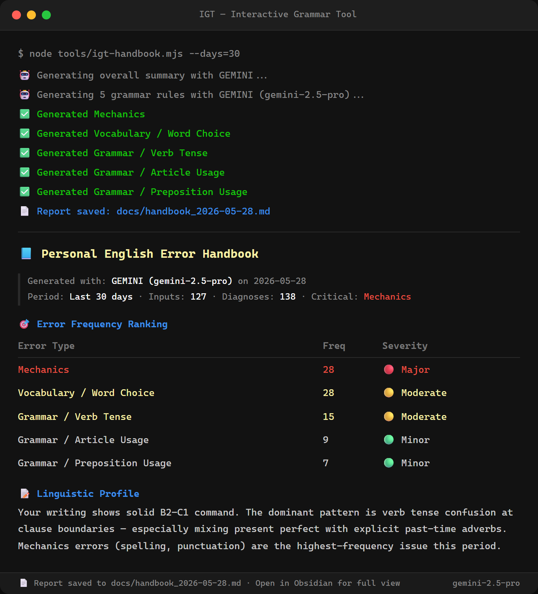
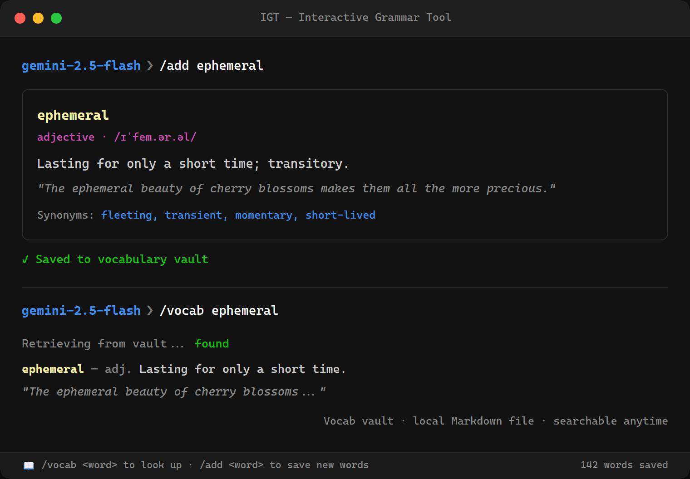

# 互动语法工具（IGT）

一款命令行英语语法检查工具，将每一次错误转化为学习机会。在提示符处输入英语句子，即可获得即时纠正和解析，同时自动积累一套以你的个人错误模式为基础的闪卡复习库。



---

## 目录

- [开始前的准备](#开始前的准备)
- [安装步骤（逐步说明）](#安装步骤逐步说明)
- [数据库初始化与迁移](#数据库初始化与迁移)
- [配置 AI 提供商](#配置-ai-提供商)
  - [方案 A — 在线 AI（Gemini、Qwen、Deepseek）](#方案-a--在线-aigeminiqwendeepseek)
  - [方案 B — 本地 AI（Ollama，无需 API 密钥）](#方案-b--本地-aiollama无需-api-密钥)
- [功能详解](#功能详解)
- [命令列表](#命令列表)
- [配置参考](#配置参考)
- [架构说明](#架构说明)
- [许可证](#许可证)

---

## 开始前的准备

运行 IGT 之前，需要在电脑上安装以下两个程序。

### 1. Node.js

Node.js 是一个能在浏览器之外运行 JavaScript 代码的程序。IGT 就是用它构建的。

- 前往 **https://nodejs.org**，下载左边的 **LTS** 版本。
- 运行安装程序，一路点击默认选项即可。
- 安装完成后，打开终端（Windows 下是命令提示符或 PowerShell，Mac/Linux 下是终端），验证安装是否成功：

  ```
  node --version
  ```

  应该显示类似 `v22.0.0` 的内容。18 及以上的任何版本均可。

### 2. Git

Git 是用于从网上下载和管理代码的工具。

- 前往 **https://git-scm.com/downloads**，下载适合你系统的安装包。
- 运行安装程序，保持默认设置。
- 验证安装：

  ```
  git --version
  ```

  应该显示类似 `git version 2.44.0` 的内容。

---

## 安装步骤（逐步说明）

打开终端，按以下步骤逐一执行。

**第 1 步 — 下载代码**

```sh
git clone https://github.com/ievertan00/igt.git
```

这会在当前目录下创建一个名为 `igt` 的文件夹。

**第 2 步 — 进入文件夹**

```sh
cd igt
```

**第 3 步 — 安装依赖**

```sh
npm install
```

这会下载 IGT 所需的第三方库（放在 `node_modules` 文件夹中）。可能需要一分钟。

**第 4 步 — 创建配置文件**

```sh
# Windows（PowerShell）：
Copy-Item .env.example .env

# Mac/Linux：
cp .env.example .env
```

这会创建你的私有 `.env` 文件，用来填写 API 密钥。

**第 5 步 — 填写 API 密钥**

用任意文本编辑器（记事本、VS Code 等）打开 `.env` 文件，填入至少一个 API 密钥。获取密钥的方法见[配置 AI 提供商](#配置-ai-提供商)。

**第 6 步 — 初始化数据库**

```sh
node scripts/init-db.mjs
```

这会创建本地 SQLite 数据库，用于保存你的语法记录、闪卡和学习进度。

**第 7 步 — 注册全局命令（可选，但推荐）**

```sh
npm link
```

完成后，你可以在任意目录的任意终端中输入 `igt` 来启动工具。只需执行一次。

**第 8 步 — 启动 IGT**

```sh
igt
```

如果跳过了第 7 步，可以直接运行：

```sh
node igt.mjs
```

看到类似 `gemini-2.5-flash ❯` 的提示符后，就可以开始输入句子了。

---

## 数据库初始化与迁移

IGT 使用本地 SQLite 数据库（`igt_data.db`）来存储你的学习进度。数据库通过迁移系统进行管理，以确保随着新功能的增加，数据库结构始终保持最新。

### 首次设置

在第一次运行 IGT 时，你必须初始化数据库：

```sh
node scripts/init-db.mjs
```

该操作将：

1. 如果数据库文件不存在，则创建它。
2. 应用核心模式（会话、输入、诊断等表格）。
3. 植入初始状态栏消息（提示、事实、语录）。

### 自动更新

每次启动 IGT 时，服务器会自动检查是否有缺失的迁移并应用它们。通常情况下，你不需要再次运行 `init-db.mjs`，除非你正在进行故障排除或手动删除了数据库文件。

### 故障排除

- **"Database is locked"**（数据库已锁定）：这通常是因为有多个 IGT 实例正在运行，或者另一个工具正在访问 `.db` 文件。请关闭所有实例后再试。
- **迁移错误**：如果迁移失败，IGT 会将错误记录在 `igt_db_error.log` 中。你可以安全地删除 `.db` 文件并运行 `node scripts/init-db.mjs` 从头开始（注意：这会抹除你的所有历史记录）。

---

## 配置 AI 提供商

IGT 支持两种使用方式：在线 AI 服务（需要免费 API 密钥）或在本地运行的 AI 模型（无需密钥）。

---

### 方案 A — 在线 AI（Gemini、Qwen、Deepseek）

以下三个服务都有免费额度，选一个开始即可。

#### Google Gemini（推荐新手首选——免费额度最大方）

1. 前往 **https://aistudio.google.com/apikey**，用 Google 账号登录。
2. 点击 **Create API key（创建 API 密钥）**。
3. 复制密钥（以 `AIza…` 开头）。
4. 打开 `.env` 文件，粘贴密钥：

   ```env
   GOOGLE_API_KEYS=AIzaSyYourKeyHere
   IGT_LLM_PROVIDER=gemini
   ```

5. 保存文件，启动 `igt`。

> 可以用英文逗号分隔多个 Gemini 密钥（`key1,key2`）——当某个密钥触发限流时，IGT 会自动切换到下一个。

---

#### 阿里云百炼（通义千问 / DashScope）

1. 前往 **https://dashscope.console.aliyun.com/apiKey**，注册并登录阿里云账号。
2. 创建 API Key 并复制。
3. 打开 `.env` 填入：

   ```env
   DASHSCOPE_API_KEYS=sk-YourKeyHere
   IGT_LLM_PROVIDER=qwen
   ```

4. 保存并启动 `igt`。

---

#### Deepseek

1. 前往 **https://platform.deepseek.com/api_keys**，注册账号。
2. 创建 API Key 并复制。
3. 打开 `.env` 填入：

   ```env
   DEEPSEEK_API_KEYS=sk-YourKeyHere
   IGT_LLM_PROVIDER=deepseek
   ```

4. 保存并启动 `igt`。

---

#### 运行中切换提供商

无需重启即可切换。在 `❯` 提示符处输入：

```
/gemini      → 切换到 Gemini
/qwen        → 切换到 Qwen
/deepseek    → 切换到 Deepseek
/ollama      → 切换到本地 Ollama
/llm status  → 查看当前提供商及已配置的密钥
```

---

### 方案 B — 本地 AI（Ollama，无需 API 密钥）

Ollama 让 AI 模型完全在你自己的电脑上运行。语法检查无需联网，没有使用限制和费用。代价是需要一台配置尚可的电脑，首次配置也需要几分钟。

**系统要求：** 最低 8 GB 内存，推荐 16 GB。独立 GPU 会显著提升速度，但不是必须的。

#### 第 1 步 — 安装 Ollama

前往 **https://ollama.com/download**，下载对应系统的安装包。Windows 运行 `.exe` 安装程序，Mac 将应用拖入 Applications，Linux 执行网站上的 shell 脚本。

验证安装：

```sh
ollama --version
```

#### 第 2 步 — 下载模型

IGT 默认使用 **Phi-4**（微软出品，14B 参数——质量好，8 GB 内存可运行）：

```sh
ollama pull phi4
```

大约下载 9 GB，只需下载一次。

如果想用更小/更快的模型，拉取后在 `igt_config.json` 中更新 `OllamaModel`：

```sh
ollama pull llama3.2   # 3B，更快，质量略低
ollama pull mistral    # 7B，速度与质量兼顾
```

#### 第 3 步 — 配置 IGT 使用 Ollama

打开 `.env` 文件，设置：

```env
IGT_LLM_PROVIDER=ollama
```

Ollama 无需 API 密钥。

#### 第 4 步 — 启动 Ollama 和 IGT

Ollama 通常会在系统启动时自动运行。如果没有，手动启动：

```sh
ollama serve
```

然后在新的终端窗口中：

```sh
igt
```

提示符会显示 `phi4 ❯`（或你设置的其他模型名）。首次请求可能需要 10–20 秒加载模型，之后的请求会更快。

---

## 功能详解

### 语法检查

在提示符处输入任意英语句子并按回车。IGT 将其发送给 AI，返回结构化分析：纠错、更地道的改写、按错误类型分类的诊断、语法规则和学习 tip。含多处错误的复杂句子一次处理完毕，每处错误独立诊断。




如果句子没有错误，IGT 会确认并解释原因——它不会捏造问题。

每次检查都会自动保存到本地数据库，并生成一张闪卡。

### 翻译（`/translate` 或自动识别）

自然地将中文文本翻译成英文。IGT 会在主提示符处自动识别中文输入，并将其发送到翻译引擎，提供包含细微差别注释和地道表达的翻译。也可以使用 `/translate <文本>`（别名：`/tr <文本>`）。



### 语法咨询 (`/ask`)

进行多轮英语语法咨询。IGT 通过原生函数调用查询其本地参考数据库 (`grammar_ref.db`)，提供带有来源引用的可靠解答。同一对话线程中的追问会携带上下文。退出时可选择将对话保存到 Markdown 笔记库。



### 状态栏与提示

每次检查后，状态栏都会从 300 多个条目中随机显示一条消息，包括：

- **提示 (Tips)**：了解类似 `/undo` 或 `/refine` 等隐藏功能。
- **语法事实 (Grammar Facts)**：关于英语历史和规则的有趣冷知识。
- **语录 (Quotes)**：来自语言学家和作家的启发性话语。

### 多行输入

输入长段落或多句话时，用 `"""` 进入多行模式：

```
❯ """
在这里输入你的文字。
在新的一行输入 """ 提交。
"""
```

### 间隔重复闪卡复习（`/review`）

每个错误都会生成一张闪卡。SM-2 算法负责调度每张卡片：答对了复习间隔会延长（1 天 → 4 天 → 10 天……），答错了则重置为明天。答案以 **diff 高亮**方式展示——修改的词标绿，一眼看出差在哪里。随着时间推移，已掌握的错误类型不再出现。



系统优先进行完全匹配判断。如果你的答案措辞不同但语义正确，会由 AI 快速裁定是否接受。

### 每日计划（`/today`）

显示今日学习安排摘要：

```
❯ /today

Today's Plan
  SRS cards due:     12
  Suggested drills:   5 exercises
  Focus area:        Verb Tense  (most frequent in last 30 days)

Launch /review now? [y/n]
```

### 数据统计 (`/stats`)

统计面板提供了学习旅程的全方位视图：



- **努力趋势 (Effort Trend)**: 过去 7 天输入量的可视化图表。
- **掌握度分析 (Mastery Breakdown)**: 识别你最频繁的错误类型（前 3 项优先任务）。
- **CEFR 轨迹 (CEFR Trajectory)**: 追踪你数月来的英语水平进步情况。

### 个人错误手册 (`/handbook`)

手册将你积累的错误记录转化为一份个性化参考文档。它不是泛泛的语法教材，而是分析你的真实错误，识别你专属的反复出现的子模式（你的"语言指纹"），并从你个人习惯的角度解释根本原因。

在命令行运行：

```sh
node tools/igt-handbook.mjs --days=30
```



**生成的文件内容示例：**

输出是一个为 Obsidian 优化的 Markdown 文件（支持可折叠标注块、表格）。以下是一段真实风格的示例：

---

```markdown
# 📘 Personal English Error Handbook

> [!INFO] Generated with: GEMINI (gemini-2.5-pro) on 2026-05-07

> [!ABSTRACT] 📊 Performance Summary
>
> - **Period**: Last 30 days
> - **Inputs Analyzed**: 283
> - **Total Diagnoses**: 156
> - **Unique Error Types**: 6
> - **Critical Priority**: Verb Tense

## 📝 Executive Linguistic Summary

### 📝 Linguistic Profile

你的写作整体达到 B1–B2 水平，词汇量和句子结构表现稳健。
在 283 条输入中，最显著的模式是从句边界处的时态混用——
尤其是在同一句话中将一般过去时和现在完成时交替使用。
拼写和标点错误极少，说明你有扎实的书面英语基础。

### 🚀 Key Strengths & Bottlenecks

- **Strength**：冠词用法已显著改善——最近两周仅出现 3 次，
  而上个月有 14 次。
- **Bottleneck**：动词时态占全部诊断的 41%。具体子模式为：
  你在带有明确过去时间状语（"yesterday"、"last week"）的
  句子中使用了现在完成时，而这类句子必须用一般过去时。

### 🎯 Strategic Goals

1. 未来两周专项训练"现在完成时 vs. 一般过去时 + 时间状语"的区分；
   每天使用 /review 复习闪卡。
2. 在 /practice 练习中针对介词搭配——固定动词介词组合
   （arrive at、good at、depend on）占剩余介词错误的大部分。
3. 三周后再次运行 /assess，确认 B2 进步轨迹。

> [!TIP] Coach's Note
> 每天针对"现在完成时 / 一般过去时"做一组专项练习，
> 就能解决你 40% 的剩余错误。

## 🎯 Error Frequency Ranking

| Error Type             | Freq | Severity    |
| :--------------------- | :--- | :---------- |
| Verb Tense             | 64   | 🔴 Major    |
| Article Usage          | 28   | 🟡 Moderate |
| Preposition Usage      | 19   | 🟡 Moderate |
| Subject-Verb Agreement | 14   | 🟢 Minor    |
| Word Choice            | 11   | 🟢 Minor    |
| Punctuation            | 9    | 🟢 Minor    |

## 📈 Weekly Trend

| Week    | Errors            |
| :------ | :---------------- |
| 2026-17 | ▓▓▓▓▓▓▓▓▓▓▓▓▓▓ 14 |
| 2026-18 | ▓▓▓▓▓▓▓▓▓▓▓ 11    |
| 2026-19 | ▓▓▓▓▓▓▓▓ 8        |
| 2026-20 | ▓▓▓▓▓ 5           |

> [!SUCCESS] ✅ Good news! Your errors decreased by 28.6% in recent weeks.

## 🔍 Detailed Error Analysis

> [!CAUTION]- 🔴 Verb Tense (64 Occurrences)
>
> ### 📝 Example 1
>
> > [!FAILURE] Original (❌)
> > `I have seen him yesterday at the office.`
>
> > [!SUCCESS] Corrected (✅)
> > `I saw him yesterday at the office.`
>
> > [!TIP] Natural Phrasing (✨)
> > `I ran into him at the office yesterday.`
>
> > [!INFO] Logic & Rules
> > **Why**: "Yesterday" 是明确的过去时间状语，不能与现在完成时连用，
> > 必须使用一般过去时（"saw"）。
> > **Rule**: 现在完成时 = 不指定具体时间。一般过去时 = 指定具体时间
> > （yesterday、last week、in 2020）。
> > **Pro Tip**: 如果能回答"具体是什么时候？"，就用一般过去时。
>
> ---
>
> ### 📝 Example 2
>
> > [!FAILURE] Original (❌)
> > `She has graduated last June and found a job immediately.`
>
> > [!SUCCESS] Corrected (✅)
> > `She graduated last June and found a job immediately.`
>
> > [!TIP] Natural Phrasing (✨)
> > `She graduated last June and landed a job right away.`
>
> > [!INFO] Logic & Rules
> > **Why**: "Last June" 是明确的过去时间——现在完成时在此无效。
> > **Rule**: 并列谓语中的两个动词必须使用相同时态。

## 📚 Grammar Rules Reference (AI-Powered)

### Grammar

> [!NOTE]- 🔴 Verb Tense
>
> #### Overview
>
> 英语时态不只是编码时间，还表达说话者与事件的关系。
> 现在完成时表示与当下时刻的相关性；一般过去时将事件封闭为已完成的历史。
> 两者不可互换。
>
> #### Detected Habit
>
> _"The Yesterday Trap（昨天陷阱）"_ —— 你在描述近期过去事件时习惯使用现在
> 完成时，随后又附上一个与之矛盾的具体时间状语。
>
> #### Root Cause
>
> 普通话用体标记（了、过）表示完成，没有时态的区分，因此现在完成时 /
> 一般过去时的对立在母语中没有直接对应物——学习者往往默认选择"听起来
> 更完整"的那种形式。
>
> #### Before / After
>
> | ❌ User wrote                        | ✅ Should be                    | Why                     |
> | :----------------------------------- | :------------------------------ | :---------------------- |
> | I have seen him yesterday.           | I saw him yesterday.            | 有具体时间 → 一般过去时 |
> | She has graduated last June.         | She graduated last June.        | "last June" 锚定了过去  |
> | We have finished the report at 5 PM. | We finished the report at 5 PM. | 时钟时间 → 一般过去时   |
>
> #### The Rule
>
> - 凡是带有具体时间状语的句子（yesterday、last week、in 2020、at 3 PM、
>   when I was young），一律使用**一般过去时**。
> - 不指定时间、强调当下结果或相关性时，使用**现在完成时**
>   （I've lost my keys — 钥匙现在还不见了）。
> - 现在完成时与具体过去时间状语**永远不能共存**。
> - 并列谓语（"she graduated and found"）中，两个动词必须时态一致。
>
> #### Mnemonic
>
> _"有具体时间，就用简单过去。"_（Specific time? Simple past every time.）
>
> > [!TIP] Key Takeaway
> > 只要能回答"具体是什么时候？"，答案就永远是一般过去时，没有例外。
```

---

**命令行选项：**

```sh
node tools/igt-handbook.mjs --days=30            # 最近 30 天（默认）
node tools/igt-handbook.mjs --days=7             # 仅本周
node tools/igt-handbook.mjs --days=0             # 全部历史数据
node tools/igt-handbook.mjs --days=30 --incremental   # 跳过无变化的章节
node tools/igt-handbook.mjs --cache-stats        # 查看缓存状态
node tools/igt-handbook.mjs --days=30 --clear-cache   # 强制完整重建
```

`--incremental` 模式会对每种错误类型的示例数据计算 MD5 哈希值。如果自上次运行以来示例未发生变化，则直接复用缓存的 LLM 输出——每周重新生成时通常能节省 60–80% 的 API 调用。

输出文件保存在 `.env` 中 `IGT_REPORT_PATH` 指定的目录下，文件名包含日期：`handbook_2026-05-07.md`。用 Obsidian 打开后，可折叠标注块、表格和提示框会以交互方式渲染。

### 专项练习 (`/practice`)

生成针对你最频繁错误类型的练习题，包含选择题和填空题，难度与你的 CEFR 水平相匹配。

```
❯ /practice

Exercise 1 of 10  [Verb Tense]
By the time she arrived, we _____ dinner.
  A) finish       B) have finished
  C) had finished D) were finishing

Your answer: C

✓ Correct — "had finished" (past perfect) is needed because the finishing happened
  before another past event ("arrived").
```

**定向练习:**
你可以使用 `--type` 标志针对特定的弱点进行练习：

```
❯ /practice --type "Verb Tense"
```

可直接指定级别和题数：

```
❯ /practice B2 10
```

或在命令行中运行：

```sh
node tools/igt-practice.mjs --count=15
node tools/igt-practice.mjs --type "Article Usage"   # 针对特定错误类型
```

### CEFR 水平评估（`/assess`）

根据你的错误记录（频率、严重程度、分布和进步趋势）估算你当前的英语水平（A1–C2）。每次评估结果都会连同评分依据的数据窗口一起存储，方便追踪长期进步轨迹。

### 词汇查询（`/add`）

查询任意单词并保存到本地 Markdown 词汇库，用 `/vocab` 随时复习。



### 撤销（`/undo`）

输错了内容，不想让它出现在闪卡库里？撤销最后一条记录：

```
❯ /undo
Delete last 1 input and all associated cards? [y/n] y
✓ Removed.
```

用 `/undo 3` 可撤销最近的 3 条输入。

---

## 命令列表

启动 IGT 后，所有命令以 `/` 开头。

| 命令                | 说明                                                      |
| ------------------- | --------------------------------------------------------- |
| `/review`           | 间隔重复复习——逐一训练今日到期的所有闪卡                  |
| `/today`            | 每日计划：到期卡片数、建议练习量、今日重点错误类型        |
| `/stats`            | 统计面板：按句子长度划分的错误率、掌握程度分布、CEFR 趋势 |
| `/handbook`         | 生成个人错误手册（后台运行）                              |
| `/practice`         | 针对你的高频错误类型启动专项练习                          |
| `/practice B2 10`   | 以 B2 难度练习 10 题                                      |
| `/assess`           | 估算当前 CEFR 英语水平                                    |
| `/ask <问题>`       | 提出语法问题，提供带本地数据库引用的解答                  |
| `/translate <文本>` | 将中文文本翻译为英文（别名：`/tr`）                       |
| `/undo [N]`         | 删除最后 N 条输入及其关联闪卡（默认 1 条）                |
| `/add <单词>`       | 查询单词并保存到词汇库                                    |
| `/vocab`            | 词汇测验；`/vocab --list` 浏览已保存词汇                  |
| `/gemini`           | 切换到 Google Gemini                                      |
| `/qwen`             | 切换到阿里云 Qwen                                         |
| `/deepseek`         | 切换到 Deepseek                                           |
| `/ollama`           | 切换到本地 Ollama 模型                                    |
| `/llm status`       | 显示当前提供商、已配置密钥和模型名称                      |
| `/help`             | 显示命令参考                                              |
| `exit`              | 退出（会先显示本次会话摘要）                              |

**快捷键：**

- `↑` / `↓` — 浏览输入历史
- `Ctrl+C` — 清空当前输入，返回提示符（不退出程序）
- `"""` — 进入多行输入模式

---

## 配置参考

IGT 使用两个配置文件：

| 文件              | 是否纳入 git | 用途                             |
| ----------------- | ------------ | -------------------------------- |
| `.env`            | 否           | API 密钥、文件路径、主题（私有） |
| `igt_config.json` | 是           | 模型名称、提示词（共享）         |

### `.env`（完整参考）

```env
# --- AI 提供商密钥 ---
GOOGLE_API_KEYS=key1,key2        # 逗号分隔；触发限流时自动轮换
DASHSCOPE_API_KEYS=your-key      # Qwen / 阿里云百炼
DEEPSEEK_API_KEYS=your-key       # Deepseek
IGT_LLM_PROVIDER=gemini          # gemini | qwen | deepseek | ollama

# --- 文件路径与设置 ---
IGT_DB_PATH=igt_data.db          # SQLite 数据库（首次运行自动创建）
IGT_LOG_PATH=igt_db_error.log    # 后台错误日志
IGT_GRAMMAR_REF_DB_PATH=grammar_ref.db # 用于 /ask 的语法参考数据库
IGT_THEME=default                # CLI 颜色主题
IGT_REVIEW_PATH=                 # 可选：Markdown 格式的纠正记录日志路径
IGT_REPORT_PATH=                 # 手册/评估报告的导出文件夹

# --- Obsidian 集成（可选） ---
IGT_VAULT_DIR=                   # Obsidian 仓库根目录
IGT_VOCABULARY_FILE=             # 仓库内的词汇笔记路径
IGT_PRACTICE_FILE=               # 仓库内的练习日志路径
IGT_ASK_FILE=                    # 仓库内的语法咨询日志路径
```

### `igt_config.json`（摘要）

```json
{
  "LLMProvider": "gemini",
  "GeminiFlashModel": "gemini-2.5-flash",
  "GeminiProModel": "gemini-2.5-pro",
  "QwenFlashModel": "qwen-turbo",
  "QwenProModel": "qwen3.6-max-preview",
  "DeepseekFlashModel": "deepseek-chat",
  "DeepseekProModel": "deepseek-reasoner",
  "OllamaBaseUrl": "http://localhost:11434/v1",
  "OllamaModel": "phi4"
}
```

Flash 模型负责语法检查（速度优先）；Pro 模型负责手册和练习生成（质量优先）。要更换 Ollama 使用的模型，修改 `OllamaModel` 的值——运行 `ollama list` 可查看本地已安装的模型。

所有 LLM 提示词存放在 `igt_config.json` 的 `Prompts` 部分，直接在那里编辑，无需改动源码。

---

## 架构说明

`igt.mjs`（交互主循环）在启动时会衍生一个持久化 HTTP 服务器（`lib/server/index.mjs`），监听端口 `18964`。每次语法检查都是一个 HTTP POST 请求到 `http://127.0.0.1:18964/grammar`，服务器返回结构化 JSON，由客户端负责渲染输出。

```
igt.mjs  ──POST /grammar──►  lib/server/index.mjs
                                    │
                          runMigrations()（启动时执行）
                          LLMProviderManager
                          ┌──────┬──────┬──────────┬────────┐
                       Gemini  Qwen  Deepseek  Ollama   ← 语法检查用 Flash 模型
                                                          手册生成用 Pro 模型
                                    │
                          parseDiagnosis() → SQLite（非阻塞）
                                    │
                          {data, perf} ◄── igt.mjs 带颜色渲染输出
```

代码库按领域驱动模块组织在 `lib/` 目录下：

- `lib/cli/` — CLI 特定逻辑、UI 渲染和命令路由。
- `lib/domain/` — 核心业务逻辑（间隔重复、掌握度跟踪、解析）。
- `lib/features/` — 特定功能逻辑（如手册生成）。
- `lib/server/` — HTTP 服务器、路由和 LLM 提供商逻辑。
- `lib/shared/` — 共享工具（如配置加载器）。

持久化服务器避免了每次请求重新启动 Node.js 的开销——典型语法检查耗时约 1.5 秒，相比冷启动方式的约 9.9 秒提升了 83%。

---

## 许可证

Apache 2.0
